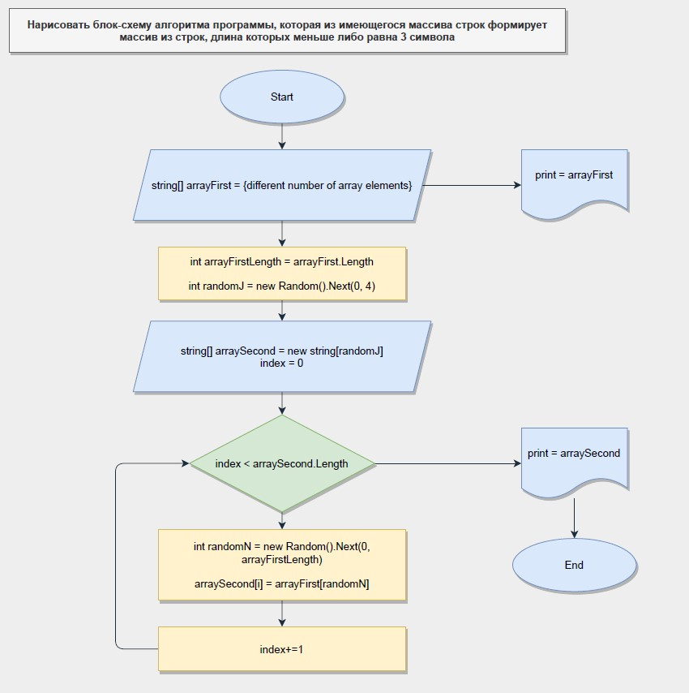

# **ЗАДАЧА**

**Нарисовать блок-схему алгоритма программы, которая из имеющегося массива строк формирует
массив из строк, длина которых меньше либо равна 3 символа. Первоначальный массив можно ввести с клавиатуры, либо задать на старте выполнения алгоритма. При решении не рекомендуется пользоваться колекциями, лучше обойтись исключительно массивами.**

# **РЕШЕНИЕ**

- **Пункт 1**
    - Создаем массив (_arrayFirst_) с текстовыми значениями (_string_). При этом колличество значений для решения задачи не важно.
    Для решения я выбрал создание массива на старте, хотя можно было использовать ввод с консоли (_Console.ReadLine()_).
- **Пункт 2**
    - Вводим переменную (_arrayFirstLength_) для определения длины созданного массива.
- **Пункт 3**
    - Выводим массив на печать.
- **Пункт 4**
    - Вводим новую рандомную переменную от 0 до 4 (_randomJ_).
- **Пункт 5**
    - Создаем новый массив (_arraySecond_) с типом строка (_string_), при это размер массива определяем с попощью введенной раннее рандомной переменной (_randomJ_).
- **Пункт 6**
    - Используя цикл **FOR**, добавляем значения из первого массива (_arrayFirst_) во второй массив (_arraySecond_), при этом используем созданную новую рандомную переменную (_randomN_) для того, чтобы значения для второго массива были рандомными по всем элементам из первого массива (_при этом значения могут дублироваться, так как это не запрещено условием задачи_).
- Пункт 7
    - Выводим второй массив на печать.

# Алгоритм решения

